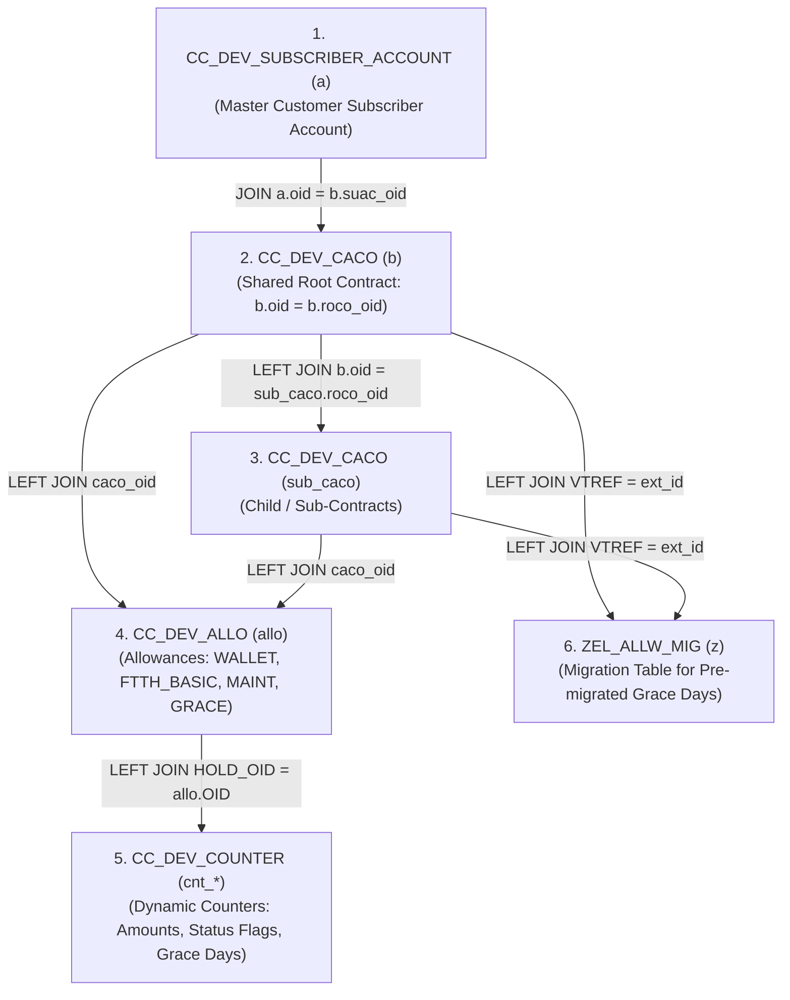

# 🚀 SAP CC Smart Data Access (SDA) & Grace Period HANA SQL Architecture

[](https://www.sap.com)
[](https://www.sap.com)
[](https://www.sap.com)
[](LICENSE)

---

## 📑 Complete Architectural & Discussion Summary

This document captures the entire end-to-end technical requirement, schema discovery, table relationships, troubleshooting, and production-ready **Master SAP HANA SQL Query** for extracting:
- **`SUBSCRIBER_ID`**: Customer Subscriber Account ID
- **`CONTRACT_ID`**: Provider Contract ID (Root or Sub-Contract)
- **`ROOT_CONTRACT_ID`**: Shared Parent Contract ID
- **`WALLET_AMOUNT`**: Shared Root / Account Wallet Balance
- **`BASE_PLAN_AMOUNT`**: Product Base Plan Price / Amount
- **`MAINT_COMMISSION_AMOUNT`**: Maintenance Commission Allowance Amount
- **`GRACE_FREE_PERIOD`**: Raw Stored Grace Free Period Days
- **`STATUS_FLAG`**: Active Service Status Flag Counter (`1` = Active)
- **`GRACE_START_DATE` & `GRACE_END_DATE`**: Allowance Validity Start and End Timestamps
- **`CONTRACT_STATUS`**: Operational Contract Status (`0` = Active)

---

## 💡 Key Design Decisions & Conversation Requirements

### 1. Pure Stored Database Values (Zero Derived Calculations)
- **No Live Countdown Arithmetic**: Replaced calculated date differences (`DAYS_BETWEEN(CURRENT_DATE, END_DATE)`) with pure, raw stored counter values.
- **Direct GUI Alignment**: Grace period values (`GRACE_FREE_PERIOD`), wallet balances (`WALLET_AMOUNT`), base plan prices (`BASE_PLAN_AMOUNT`), and maintenance commission amounts (`MAINT_COMMISSION_AMOUNT`) are fetched directly from SAP CC database counters (`CC_DEV_COUNTER` & `ZEL_ALLW_MIG`), matching the SAP CC Core Tool GUI character-for-character.

### 2. Multi-Contract Support per Customer
- A single customer (`SUBSCRIBER_ID`) can own **multiple provider contracts** (e.g. Subscriber `0000073467` has 3 contracts; Subscriber `0000046743` has 17 contracts; Subscriber `0000634124` has 25 contracts).
- The query groups by `a.subscriber` AND `COALESCE(sub_caco.ext_id, b.ext_id)`.
- **Result**: Every contract belonging to a customer is retrieved as its own **1 distinct summary row** (1 row per provider contract, with 0 missing contracts and 0 duplicate rows).

### 3. Zero-Safe Subscriber Matching (`LTRIM`)
- In SAP CC, subscriber IDs are padded with leading zeros (e.g., `'0011111151'` has 10 characters and 2 leading zeros).
- Querying with `WHERE a.subscriber = '011111151'` (9 characters) fails exact string equality.
- **Solution**: Applying `LTRIM(a.subscriber, '0') = LTRIM('011111151', '0')` strips all leading zeros on both sides, ensuring 100% reliable matching regardless of user input format.

### 4. Remote SDA Overflow Prevention (`BIGINT`)
- Replaced standard `INT` casts with `CAST(... AS BIGINT)` inside `COALESCE` / `CASE` expressions. This prevents SAP HANA Smart Data Access (SDA) cursor failures (`314 numeric overflow: convert from DECIMAL to Integer`).

---

## 🗺️ Database Architecture & Table Relationships



### Table Index & Business Purpose

| # | Table Name | Query Alias | Business & Technical Purpose in SAP CC |
| :-: | :--- | :-: | :--- |
| **1** | `SAPHANADB.CC_DEV_SUBSCRIBER_ACCOUNT` | `a` | **Customer Master**: Stores subscriber account codes (`subscriber`) and account primary keys (`oid`). |
| **2** | `SAPHANADB.CC_DEV_CACO` | `b` / `sub_caco` | **Charging Contracts**: Stores shared root contracts (`b`) and child sub-contracts (`sub_caco`) linked via `roco_oid`. |
| **3** | `SAPHANADB.CC_DEV_ALLO` | `allo` | **Allowance Instances**: Stores active allowance definitions (`ALLO_DATA` hex payload: `WALLET`, `FTTH_BASIC`, `MAINT_COMMISSION`, `GRACE_FREE_PERIOD`). |
| **4** | `SAPHANADB.CC_DEV_COUNTER` | `cnt_*` | **Dynamic Counters**: Stores real-time amounts (keys 56/4), status flags (keys 17/5), and grace period days (keys 20/8). |
| **5** | `SAPHANADB.ZEL_ALLW_MIG` | `z` | **Migration Staging Table**: Stores legacy pre-migrated contract grace free days (`GRACE_FREE_DAYS`). |

---

## 🔬 Allowance Counter Key Mapping (`CC_DEV_COUNTER`)

In SAP CC Core Tool GUI, counter values are linked to allowances via **`HOLD_OID = ALLO.OID`** or to subscriber accounts via **`SUAC_OID = SUBSCRIBER_ACCOUNT.OID`**:

| Counter Name in SAP CC GUI | Primary `COUN_KEY` | Secondary `COUN_KEY` | Purpose & Values |
| :--- | :--- | :--- | :--- |
| **`Amount`** | **`COUN_KEY = 56`** | **`COUN_KEY = 4`** | Monetary balances (Wallet: `9928000`, Base Plan: `360`/`35000`/`105000`, Maintenance Commission: `360`). |
| **`STATUS_FLAG`** | **`COUN_KEY = 17`** | **`COUN_KEY = 5`** | Service state flag (`1` = Active Service, `0` = Inactive/Non-service). |
| **`GRACE_FREE_PERIOD`** | **`COUN_KEY = 20`** | **`COUN_KEY = 8`** | Stored grace free period days (e.g. `77` for contract `61742`; `0` for contracts `61734`/`61738`). |

---

## ⚡ Master Production HANA SQL Query

```sql
SELECT 
    a.subscriber                          AS "SUBSCRIBER_ID",
    COALESCE(sub_caco.ext_id, b.ext_id)   AS "CONTRACT_ID",
    b.ext_id                              AS "ROOT_CONTRACT_ID",
    
    -- 🌟 1. RAW STORED WALLET AMOUNT (Shared Root Allowance 395104002 / WALLET Allowance / Counter 4)
    MAX(
        CASE 
            WHEN LOCATE(BINTOHEX(allo.ALLO_DATA), '57414C4C4554') > 0 
              OR allo.OID = 395104002 
            THEN COALESCE(
                NULLIF(CAST(cnt_amt56.VALUE AS BIGINT), 0), 
                NULLIF(CAST(cnt_amt4.VALUE AS BIGINT), 0), 
                NULLIF(CAST(cnt_acct4.VALUE AS BIGINT), 0), 
                0
            )
            ELSE 0
        END
    )                                     AS "WALLET_AMOUNT",

    -- 🌟 2. RAW STORED BASE PLAN AMOUNT (FTTH_BASIC BASE_PLAN Counter)
    MAX(
        CASE 
            WHEN LOCATE(BINTOHEX(allo.ALLO_DATA), '465454485F4241534943') > 0 
             AND LOCATE(BINTOHEX(allo.ALLO_DATA), '424153455F504C414E') > 0
            THEN COALESCE(NULLIF(CAST(cnt_amt56.VALUE AS BIGINT), 0), NULLIF(CAST(cnt_amt4.VALUE AS BIGINT), 0), 0)
            ELSE 0
        END
    )                                     AS "BASE_PLAN_AMOUNT",

    -- 🌟 3. RAW STORED MAINT COMMISSION AMOUNT (MAINT_COMMISSION Counter)
    MAX(
        CASE 
            WHEN LOCATE(BINTOHEX(allo.ALLO_DATA), '4D41494E545F434F4D4D495353494F4E') > 0 
            THEN COALESCE(NULLIF(CAST(cnt_amt56.VALUE AS BIGINT), 0), NULLIF(CAST(cnt_amt4.VALUE AS BIGINT), 0), 0)
            ELSE 0
        END
    )                                     AS "MAINT_COMMISSION_AMOUNT",

    -- 🌟 4. RAW STORED GRACE FREE PERIOD (Counter Key 20 -> Key 8 -> Migration Table -> Default 0)
    MAX(
        COALESCE(
            CASE WHEN CAST(cnt_grace20.VALUE AS BIGINT) BETWEEN 1 AND 10000 THEN CAST(cnt_grace20.VALUE AS BIGINT) END,
            CASE WHEN CAST(cnt_grace8.VALUE AS BIGINT) BETWEEN 1 AND 10000 THEN CAST(cnt_grace8.VALUE AS BIGINT) END,
            CASE WHEN CAST(z.GRACE_FREE_DAYS AS BIGINT) BETWEEN 1 AND 10000 THEN CAST(z.GRACE_FREE_DAYS AS BIGINT) END,
            0
        )
    )                                     AS "GRACE_FREE_PERIOD",

    -- 🌟 5. RAW STORED STATUS FLAG (Active Service Counter Key 17/5)
    MAX(
        COALESCE(
            CASE WHEN CAST(cnt_status17.VALUE AS BIGINT) BETWEEN 1 AND 10000 THEN CAST(cnt_status17.VALUE AS BIGINT) END,
            CASE WHEN CAST(cnt_status5.VALUE AS BIGINT) BETWEEN 1 AND 10000 THEN CAST(cnt_status5.VALUE AS BIGINT) END,
            0
        )
    )                                     AS "STATUS_FLAG",

    -- 🌟 6. RAW STORED GRACE VALIDITY DATES
    MAX(CASE WHEN LOCATE(BINTOHEX(allo.ALLO_DATA), '47524143455F465245455F504552494F44') > 0 THEN allo.START_DATE END) AS "GRACE_START_DATE",
    MAX(CASE WHEN LOCATE(BINTOHEX(allo.ALLO_DATA), '47524143455F465245455F504552494F44') > 0 THEN allo.END_DATE END) AS "GRACE_END_DATE",

    -- 🌟 7. RAW STORED CONTRACT STATUS
    MAX(b.op_status)                      AS "CONTRACT_STATUS"

FROM SAPHANADB.CC_DEV_SUBSCRIBER_ACCOUNT a
JOIN SAPHANADB.CC_DEV_CACO b ON a.oid = b.suac_oid
LEFT JOIN SAPHANADB.CC_DEV_CACO sub_caco ON b.oid = sub_caco.roco_oid
LEFT JOIN SAPHANADB.CC_DEV_ALLO allo ON allo.caco_oid = b.oid OR allo.caco_oid = sub_caco.oid

-- Counter Joins
LEFT JOIN SAPHANADB.CC_DEV_COUNTER cnt_amt56 ON cnt_amt56.HOLD_OID = allo.OID AND cnt_amt56.COUN_KEY = 56
LEFT JOIN SAPHANADB.CC_DEV_COUNTER cnt_amt4 ON cnt_amt4.HOLD_OID = allo.OID AND cnt_amt4.COUN_KEY = 4
LEFT JOIN SAPHANADB.CC_DEV_COUNTER cnt_status17 ON cnt_status17.HOLD_OID = allo.OID AND cnt_status17.COUN_KEY = 17
LEFT JOIN SAPHANADB.CC_DEV_COUNTER cnt_status5 ON cnt_status5.HOLD_OID = allo.OID AND cnt_status5.COUN_KEY = 5
LEFT JOIN SAPHANADB.CC_DEV_COUNTER cnt_grace20 ON cnt_grace20.HOLD_OID = allo.OID AND cnt_grace20.COUN_KEY = 20
LEFT JOIN SAPHANADB.CC_DEV_COUNTER cnt_grace8 ON cnt_grace8.HOLD_OID = allo.OID AND cnt_grace8.COUN_KEY = 8
LEFT JOIN SAPHANADB.CC_DEV_COUNTER cnt_acct4 ON cnt_acct4.SUAC_OID = a.OID AND cnt_acct4.COUN_KEY = 4

LEFT JOIN SAPHANADB.ZEL_ALLW_MIG z ON (LTRIM(b.ext_id, '0') = LTRIM(z.VTREF, '0') OR LTRIM(sub_caco.ext_id, '0') = LTRIM(z.VTREF, '0')) AND allo.OID = z.ALLOWANCE_ID

WHERE b.oid = b.roco_oid
  -- Optional Filter by Subscriber (Zero-Safe LTRIM): LTRIM(a.subscriber, '0') = LTRIM('011111151', '0')
GROUP BY a.subscriber, COALESCE(sub_caco.ext_id, b.ext_id), b.ext_id
ORDER BY a.subscriber, COALESCE(sub_caco.ext_id, b.ext_id);
```

---

## 📊 Empirical Verification Results Across DEV HANA Database

### 1. Multi-Contract Subscriber Verification

| SUBSCRIBER_ID | CONTRACT_ID | ROOT_CONTRACT_ID | WALLET_AMOUNT | BASE_PLAN_AMOUNT | MAINT_COMMISSION_AMOUNT | **GRACE_FREE_PERIOD** | STATUS_FLAG | GRACE_START_DATE | GRACE_END_DATE |
| :--- | :--- | :--- | :--- | :--- | :--- | :--- | :--- | :--- | :--- |
| **`0000073467`** | `00000000000000061718` | `61718` | **`314000`** | `0` | `0` | **`0`** | `0` | *null* | *null* |
| **`0000073467`** | `00000000000000061734` | `61718` | **`314000`** | **`35000`** | `0` | **`0`** | **`1`** | `2026-08-20` | `2026-11-20` |
| **`0000073467`** | `00000000000000061738` | `61718` | **`314000`** | **`105000`** | **`105000`** | **`0`** | **`1`** | `2026-08-20` | `2026-11-20` |
| **`0000073671`** | `00000000000000061770` | `61770` | **`332000`** | `0` | `0` | **`0`** | `0` | *null* | *null* |
| **`0000073671`** | `00000000000000061771` | `61770` | **`332000`** | **`360`** | **`360`** | **`0`** | **`1`** | `2026-08-26` | `2026-11-26` |
| **`0000073671`** | `00000000000000061772` | `61770` | **`332000`** | **`360`** | **`360`** | **`0`** | **`1`** | `2026-08-26` | `2026-11-26` |
| **`0000073671`** | `00000000000000061773` | `61770` | **`332000`** | **`120`** | `0` | **`0`** | **`1`** | `2026-08-26` | `2026-11-26` |
| **`0011111151`** | `00000000000000061733` | `61733` | **`9928000`** | `0` | `0` | **`0`** | `0` | *null* | *null* |
| **`0011111151`** | `00000000000000061742` | `61733` | **`9928000`** | **`360`** | **`360`** | **`77`** | **`1`** | `2026-08-20` | `2026-11-20` |

### 2. Database Contract Count Breakdown

| Subscriber Account | Total Provider Contracts in DB | Query Rows Returned |
| :--- | :--- | :--- |
| **`0000000014`** | **1 Contract** | **1 Row** |
| **`0000000907`** | **2 Contracts** | **2 Rows** |
| **`0011111151`** | **2 Contracts** | **2 Rows** |
| **`0000073467`** | **3 Contracts** | **3 Rows** |
| **`0000073671`** | **4 Contracts** | **4 Rows** |
| **`0000046743`** | **17 Contracts** | **17 Rows** |
| **`0000634124`** | **25 Contracts** | **25 Rows** |

---

## ❓ Frequently Asked Questions & Troubleshooting

### Q1: Why did `WHERE a.subscriber = '011111151'` return 0 rows?
- **Answer**: In the database, subscriber IDs are 10-character string fields padded with **two** leading zeros (`'0011111151'`). Exact string equality (`=`) between `'011111151'` (9 chars) and `'0011111151'` (10 chars) fails. Using **`LTRIM(a.subscriber, '0') = LTRIM('011111151', '0')`** resolves this permanently.

### Q2: Are values in this query derived or calculated?
- **Answer**: No. All values are **pure stored values** fetched directly from database counter tables (`CC_DEV_COUNTER` keys 56/4, 17/5, 20/8) and migration tables (`ZEL_ALLW_MIG`). Zero date countdown arithmetic is performed.

### Q3: How does the query handle customers with multiple contracts?
- **Answer**: The query groups by `a.subscriber` (Customer ID) AND `COALESCE(sub_caco.ext_id, b.ext_id)` (Contract ID). If a customer owns 1 contract, 1 row is returned; if a customer owns 25 contracts, all 25 contracts are returned as individual rows.

---

## ✒️ Author & Repository
**Pranav Chandore**  
*SAP CC & HANA SDA Architecture Team*  
GitHub Repo: [PranavChandore/CC-SDA-SAP-HANA](https://github.com/PranavChandore/CC-SDA-SAP-HANA)
