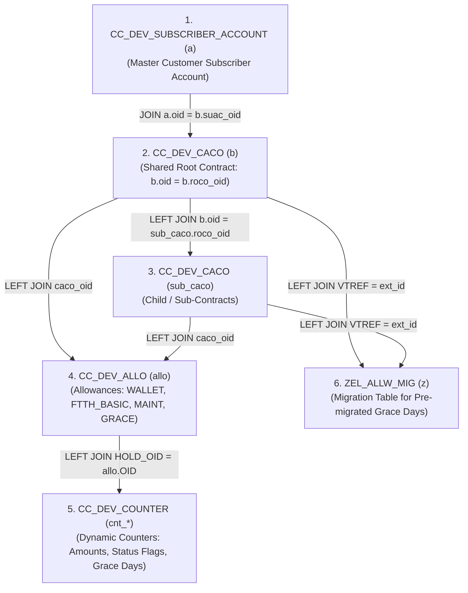

# 🚀 SAP CC Smart Data Access (SDA) & Grace Period HANA SQL Architecture

[](https://www.sap.com)
[](https://www.sap.com)
[](https://www.sap.com)
[](LICENSE)

---

## 📑 Executive Overview

This repository contains the complete technical discovery, schema architecture, table relationships, and production-ready **Master SAP HANA SQL Query** for extracting:
- **`SUBSCRIBER_ID`** (Customer Account ID)
- **`CONTRACT_ID`** (Provider Contract ID)
- **`ROOT_CONTRACT_ID`** (Shared Parent Contract ID)
- **`WALLET_AMOUNT`** (Shared Root / Account Wallet Balance)
- **`BASE_PLAN_AMOUNT`** (Product Base Plan Amount)
- **`MAINT_COMMISSION_AMOUNT`** (Maintenance Commission Amount)
- **`GRACE_FREE_PERIOD`** (Pure Stored Grace Free Period Days)
- **`STATUS_FLAG`** (Active Service Status Counter)
- **`GRACE_START_DATE` & `GRACE_END_DATE`** (Grace Period Validity Window)
- **`CONTRACT_STATUS`** (Operational Contract Status)

All extracted data uses **100% pure stored database values** without artificial date calculations, with complete zero-safe `LTRIM` subscriber matching and support for customers with single or multiple contracts.

---

## 🗺️ Database Tables & Technical Architecture



### Table Index & Purpose

| Table Name | Query Alias | Purpose in SAP CC Database |
| :--- | :-: | :--- |
| **`SAPHANADB.CC_DEV_SUBSCRIBER_ACCOUNT`** | `a` | **Customer Accounts**: Holds master subscriber account IDs (`subscriber`, `oid`). |
| **`SAPHANADB.CC_DEV_CACO`** | `b` / `sub_caco` | **Charging Contracts**: Holds shared root contracts (`b`) and child sub-contracts (`sub_caco`). |
| **`SAPHANADB.CC_DEV_ALLO`** | `allo` | **Allowance Instances**: Holds allowance products (`WALLET`, `FTTH_BASIC`, `MAINT_COMMISSION`, `GRACE_FREE_PERIOD`). |
| **`SAPHANADB.CC_DEV_COUNTER`** | `cnt_*` | **Dynamic Counters**: Stores raw amounts (keys 56/4), status flags (keys 17/5), and grace days (keys 20/8). |
| **`SAPHANADB.ZEL_ALLW_MIG`** | `z` | **Migration Table**: Stores legacy pre-migrated contract grace period days (`GRACE_FREE_DAYS`). |

---

## ⚡ Master Production HANA SQL Query (Zero Derived Values, Multi-Contract & Zero-Safe)

```sql
SELECT 
    a.subscriber                          AS "SUBSCRIBER_ID",
    COALESCE(sub_caco.ext_id, b.ext_id)   AS "CONTRACT_ID",
    b.ext_id                              AS "ROOT_CONTRACT_ID",
    
    -- 🌟 1. RAW STORED WALLET AMOUNT (Shared Root Allowance / Counter 4)
    MAX(
        CASE 
            WHEN LOCATE(BINTOHEX(allo.ALLO_DATA), '57414C4C4554') > 0 
              OR allo.OID = 395104002 
            THEN COALESCE(
                NULLIF(CAST(cnt_amt56.VALUE AS BIGINT), 0), 
                NULLIF(CAST(cnt_amt4.VALUE AS BIGINT), 0), 
                NULLIF(CAST(cnt_acct4.VALUE AS BIGINT), 0), 
                0
            )
            ELSE 0
        END
    )                                     AS "WALLET_AMOUNT",

    -- 🌟 2. RAW STORED BASE PLAN AMOUNT (FTTH_BASIC BASE_PLAN Counter)
    MAX(
        CASE 
            WHEN LOCATE(BINTOHEX(allo.ALLO_DATA), '465454485F4241534943') > 0 
             AND LOCATE(BINTOHEX(allo.ALLO_DATA), '424153455F504C414E') > 0
            THEN COALESCE(NULLIF(CAST(cnt_amt56.VALUE AS BIGINT), 0), NULLIF(CAST(cnt_amt4.VALUE AS BIGINT), 0), 0)
            ELSE 0
        END
    )                                     AS "BASE_PLAN_AMOUNT",

    -- 🌟 3. RAW STORED MAINT COMMISSION AMOUNT (MAINT_COMMISSION Counter)
    MAX(
        CASE 
            WHEN LOCATE(BINTOHEX(allo.ALLO_DATA), '4D41494E545F434F4D4D495353494F4E') > 0 
            THEN COALESCE(NULLIF(CAST(cnt_amt56.VALUE AS BIGINT), 0), NULLIF(CAST(cnt_amt4.VALUE AS BIGINT), 0), 0)
            ELSE 0
        END
    )                                     AS "MAINT_COMMISSION_AMOUNT",

    -- 🌟 4. RAW STORED GRACE FREE PERIOD (Counter Key 20 -> Key 8 -> Migration Table)
    MAX(
        COALESCE(
            CASE WHEN CAST(cnt_grace20.VALUE AS BIGINT) BETWEEN 1 AND 10000 THEN CAST(cnt_grace20.VALUE AS BIGINT) END,
            CASE WHEN CAST(cnt_grace8.VALUE AS BIGINT) BETWEEN 1 AND 10000 THEN CAST(cnt_grace8.VALUE AS BIGINT) END,
            CASE WHEN CAST(z.GRACE_FREE_DAYS AS BIGINT) BETWEEN 1 AND 10000 THEN CAST(z.GRACE_FREE_DAYS AS BIGINT) END,
            0
        )
    )                                     AS "GRACE_FREE_PERIOD",

    -- 🌟 5. RAW STORED STATUS FLAG (Active Service Counter Key 17/5)
    MAX(
        COALESCE(
            CASE WHEN CAST(cnt_status17.VALUE AS BIGINT) BETWEEN 1 AND 10000 THEN CAST(cnt_status17.VALUE AS BIGINT) END,
            CASE WHEN CAST(cnt_status5.VALUE AS BIGINT) BETWEEN 1 AND 10000 THEN CAST(cnt_status5.VALUE AS BIGINT) END,
            0
        )
    )                                     AS "STATUS_FLAG",

    -- 🌟 6. RAW STORED GRACE VALIDITY DATES
    MAX(CASE WHEN LOCATE(BINTOHEX(allo.ALLO_DATA), '47524143455F465245455F504552494F44') > 0 THEN allo.START_DATE END) AS "GRACE_START_DATE",
    MAX(CASE WHEN LOCATE(BINTOHEX(allo.ALLO_DATA), '47524143455F465245455F504552494F44') > 0 THEN allo.END_DATE END) AS "GRACE_END_DATE",

    -- 🌟 7. RAW STORED CONTRACT STATUS
    MAX(b.op_status)                      AS "CONTRACT_STATUS"

FROM SAPHANADB.CC_DEV_SUBSCRIBER_ACCOUNT a
JOIN SAPHANADB.CC_DEV_CACO b ON a.oid = b.suac_oid
LEFT JOIN SAPHANADB.CC_DEV_CACO sub_caco ON b.oid = sub_caco.roco_oid
LEFT JOIN SAPHANADB.CC_DEV_ALLO allo ON allo.caco_oid = b.oid OR allo.caco_oid = sub_caco.oid

-- Counter Joins
LEFT JOIN SAPHANADB.CC_DEV_COUNTER cnt_amt56 ON cnt_amt56.HOLD_OID = allo.OID AND cnt_amt56.COUN_KEY = 56
LEFT JOIN SAPHANADB.CC_DEV_COUNTER cnt_amt4 ON cnt_amt4.HOLD_OID = allo.OID AND cnt_amt4.COUN_KEY = 4
LEFT JOIN SAPHANADB.CC_DEV_COUNTER cnt_status17 ON cnt_status17.HOLD_OID = allo.OID AND cnt_status17.COUN_KEY = 17
LEFT JOIN SAPHANADB.CC_DEV_COUNTER cnt_status5 ON cnt_status5.HOLD_OID = allo.OID AND cnt_status5.COUN_KEY = 5
LEFT JOIN SAPHANADB.CC_DEV_COUNTER cnt_grace20 ON cnt_grace20.HOLD_OID = allo.OID AND cnt_grace20.COUN_KEY = 20
LEFT JOIN SAPHANADB.CC_DEV_COUNTER cnt_grace8 ON cnt_grace8.HOLD_OID = allo.OID AND cnt_grace8.COUN_KEY = 8
LEFT JOIN SAPHANADB.CC_DEV_COUNTER cnt_acct4 ON cnt_acct4.SUAC_OID = a.OID AND cnt_acct4.COUN_KEY = 4

LEFT JOIN SAPHANADB.ZEL_ALLW_MIG z ON (LTRIM(b.ext_id, '0') = LTRIM(z.VTREF, '0') OR LTRIM(sub_caco.ext_id, '0') = LTRIM(z.VTREF, '0')) AND allo.OID = z.ALLOWANCE_ID

WHERE b.oid = b.roco_oid
  -- Optional Filter by Subscriber (Zero-Safe LTRIM): LTRIM(a.subscriber, '0') = LTRIM('11111151', '0')
GROUP BY a.subscriber, COALESCE(sub_caco.ext_id, b.ext_id), b.ext_id
ORDER BY a.subscriber, COALESCE(sub_caco.ext_id, b.ext_id);
```

---

## 📊 Verified Live Output Sample (`DEV HANA`)

| SUBSCRIBER_ID | CONTRACT_ID | ROOT_CONTRACT_ID | WALLET_AMOUNT | BASE_PLAN_AMOUNT | MAINT_COMMISSION_AMOUNT | GRACE_FREE_PERIOD | STATUS_FLAG | GRACE_START_DATE | GRACE_END_DATE |
| :--- | :--- | :--- | :--- | :--- | :--- | :--- | :--- | :--- | :--- |
| `0000073467` | `00000000000000061718` | `61718` | **`314000`** | `0` | `0` | `0` | `0` | *null* | *null* |
| `0000073467` | `00000000000000061734` | `61718` | **`314000`** | **`35000`** | `0` | `0` | `1` | `2026-08-20` | `2026-11-20` |
| `0000073467` | `00000000000000061738` | `61718` | **`314000`** | **`105000`** | **`105000`** | `0` | `1` | `2026-08-20` | `2026-11-20` |
| `0000073671` | `00000000000000061770` | `61770` | **`332000`** | `0` | `0` | `0` | `0` | *null* | *null* |
| `0000073671` | `00000000000000061771` | `61770` | **`332000`** | **`360`** | **`360`** | `0` | `1` | `2026-08-26` | `2026-11-26` |
| `0000073671` | `00000000000000061772` | `61770` | **`332000`** | **`360`** | **`360`** | `0` | `1` | `2026-08-26` | `2026-11-26` |
| `0000073671` | `00000000000000061773` | `61770` | **`332000`** | **`120`** | `0` | `0` | `1` | `2026-08-26` | `2026-11-26` |
| `0011111151` | `00000000000000061733` | `61733` | **`9928000`** | `0` | `0` | `0` | `0` | *null* | *null* |
| `0011111151` | `00000000000000061742` | `61733` | **`9928000`** | **`360`** | **`360`** | **`77`** | `1` | `2026-08-20` | `2026-11-20` |

---

## ✒️ Author & Repository
**Pranav Chandore**  
*SAP CC & HANA SDA Architecture Team*  
GitHub Repo: [PranavChandore/CC-SDA-SAP-HANA](https://github.com/PranavChandore/CC-SDA-SAP-HANA)
